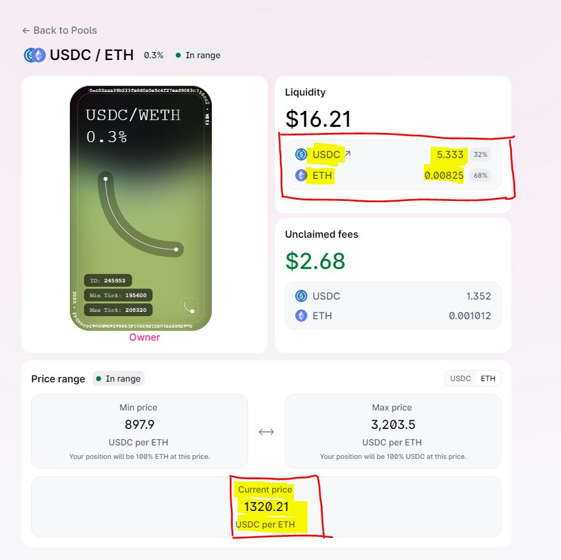
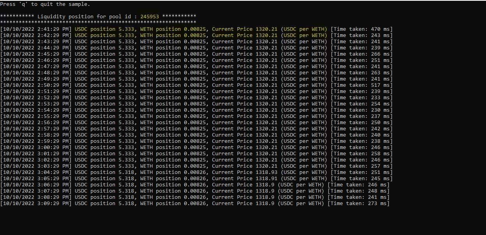
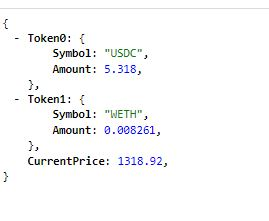

## Overview

This project has a console application [also a web api, mentioned below] written in c# which connects to the `Uniswap API v3` and collects the liquidity positions
of both the cryptocurrencies of a user defined liquidity pool.

Below are the information it fetches and shows them on console (in addition to writting them in log files).

- Position of token0 (USDC in this example)
- Position of token1 (ETH in this example)
- Current price of token0:token1 (USDC per ETH in this example)

Example: Lets say, you want to fetch the below highlighted information for pool id [245953](https://app.uniswap.org/#/pool/245953).



Run the application and here is the output information fetched from `Uniswap API v3`.



**Note:**
- You can set the pool id, precisions and also the interval after which the application should fetch the information from `Uniswap API v3`.

```
# app.config

  <appSettings>
    <add key="PoolId" value="245953" />
    <add key="PrecisionForPosition0" value="3" />
    <add key="PrecisionForPosition1" value="6" />
    <add key="PrecisionForCurrentPrice" value="2" />
    <add key="IntervalInSeconds" value="60" />
  </appSettings>
```
- You can also control the output by customizing configuration in `log4net.config`. (eg.: change the log directory, pattern, rolling style etc.)

```
# log4net.config
  <root>
    <level value="ALL" />
    <!--<appender-ref ref="console" />-->
    <appender-ref ref="file" />
  </root>
```
- When network is disconnected/fluctuated, It retries in a smart way which automatically calculates the number of retries to be done exponentially based on `IntervalInSeconds` provided
in `app.config`. For example: for a given interval 60 seconds, lets say first trigger is at `10:30`. If Uniswap API can not be connected, then there will be maximum 4 retries (auto calculated).
	- First retry will be done after 5 seconds `[10:30:05]`
	- 2nd retry will be done after 10 seconds `[10:30:15]`
	- 3rd retry will be done after 15 seconds `[10:30:30]`
	- 4th retry will be done after 20 seconds `[10:30:50]`
	- If API still can not be connected, then send error `Unable to retrieve the data from server after 4 retries.`
	- A new timer will be triggered at `[10:31:00]`.

- There is also an webapi project, which exposes endpoint `positions` to allow you fetch the same information. On `Uniswap.WebApi` in visual studio, right click and select `Set as Startup project` and run the api.



**Note:**
- Format of api is `positions/<pool_id>/<token0_precision>/<token1_precision>/<currentprice_precision>`. Few examples:
	- https://`<address>`/positions/245953  => Shows the information with no truncation.
	- https://`<address>`/positions/245953/3 => Truncates only token0 position with 3 decimal precision
	- https://`<address>`/positions/245953/3/6  => Truncates token0 position with 3 decimal precisions and token1 position with 6 precision.
	- https://`<address>`/positions/245953/null/null/2 =>  Truncate only current price with 2 decimal precision.
